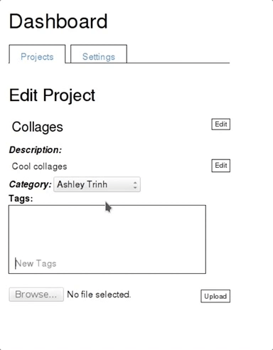
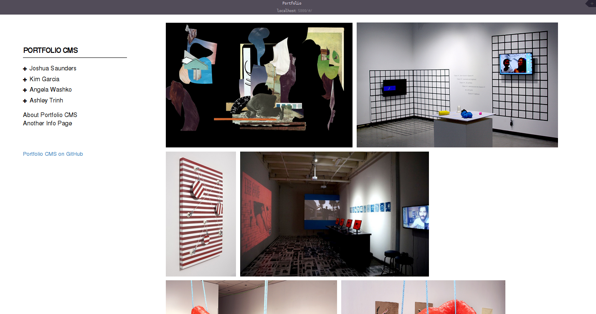

> Good design is as little design as possible

-- Dieter Rams

# Portfolio CMS


A lightweight web content management system for creative professionals and hobbyists.

## Contents
* [Technologies used](#tech)
* [How to build locally](#build)
* [Notable features](#notes)
* [TODO](#todo)

## <a name="tech"></a>Technologies used
* PostgreSQL
* SQLAlchemy
* Flask
* AngularJS
* Bootstrap

## <a name="build"></a>How to build locally
* Create and activate your virtual environment
  ```
  virtualenv -p /usr/bin/python2.7 <path/to/virtualenv>
  source <path/to/virtualenv>/bin/activate
  ```
* Install dependencies
  ```
  pip install -r requirements.txt
  ```
* Make sure you have PostgreSQL installed, then create a database called `portfolio`
  ```
  createdb portfolio
  ```
* Create necessary tables in the database
  ```
  python -i model.py
  db.create_all()
  ```
* Start server
  ```
  python server.py
  ```
* View pubilc portfolio page at `localhost:5000` or admin dashboard at `localhost:5000/admin/dashboard`

## <a name="notes"></a>Notable features
* Robust API *(API docs are coming soon...)*
  * Get ALL the information from the database
* JSONMixin
  * Recursively generate JSON from database objects - works with multiple, nested joins
* Just slap it on your server
  * It's open source so it's free

## <a name="todo"></a>TODO
* You can't actually "just slap it on your server" at the moment but soon I will minimize the amount of setup you'd have to do
* Security is bad - haven't implemented good password hashing yet
* Leverage use of global resolves/service to minimize work on the server and database
* UI style is inconsistent in some places
* Render live preview of portfolio on the dashboard
